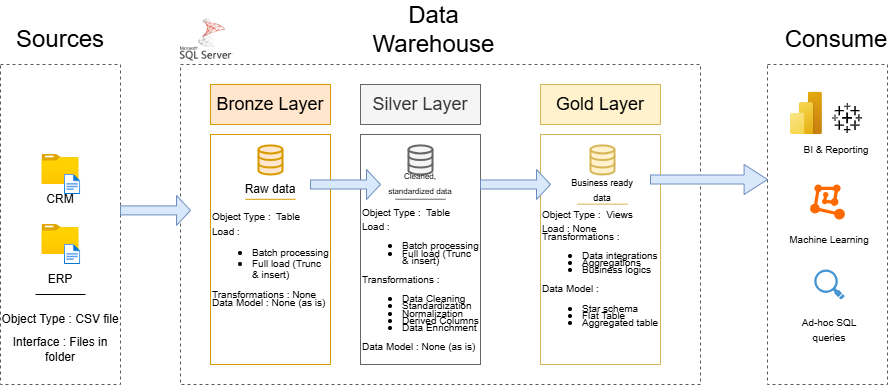

# Datawarehouse and Analytics project

This project aims to provide a comprehensive datawarehousing and analytics solution.
Includes designing the architecture of the data warehosue, data modeling and industry practices for data engineering and analytics.

This project is designed to fit in a personal portfolio.

---

---

## 📖 Project Overview

This project involves:

1. **Data Architecture**: Designing a Modern Data Warehouse using the Medallion Architecture **Bronze**, **Silver**, and **Gold** layers.
2. **ETL Pipelines**: Extracting, transforming, and loading data from source systems into the warehouse.
3. **Data Modeling**: Developing fact and dimension tables optimized for analytical queries.
4. **Analytics & Reporting**: Creating SQL-based reports and dashboards for actionable insights.

---

### Project Requirements

Building the Data Warehouse

**Objective**

Design and develop a modern data warehosue using SQL server to consolidate sales data, enabling analytical reporting and informed decision-making.

**Specifications**

- Data Sources : Import data from two source systems (ERP and CRM ) provided as CSV files
- Data Quality : Clean and resolve data quality issues prior to analysis
- Integration : Combine both sources into a single, user-friendly data model designed for analytical queries
- Scope : Focus on the latest dataset only; historization of data is not required
- Documentation : Provide clear documentation of the data model to support business stakeholders and the analytics team

---

## Data Architecture

The data architecture for this project follows the Medallion Architecture **Bronze**, **Silver**, and **Gold** layers:


1. **Bronze Layer**: Stores raw data as-is from the source systems. Data is ingested from CSV Files into SQL Server Database.
2. **Silver Layer**: This layer includes data cleaning, standardization, and normalization processes to prepare data for analysis.
3. **Gold Layer**: Stores business-ready data modeled into a star schema required for reporting and analytics.

### Analytics and Reporting

#### Objective

Develop SQL-based analytics to deliver detailed insights into:

- **Customer Behavior**
- **Product Performance**
- **Sales Trends**

These insights provide stakeholders with key business metrics, enabling strategic decision-making.

---

## 📂 Repository Structure

```

project-datawarehouse/
│
├── datasets/                           # Raw datasets used for the project (ERP and CRM data)
│
├── docs/                               # Project documentation and architecture details
│   ├── img/                            # Image files of the project architecture
│   ├── dia/                            # Draw.io diagram files for the project
│       ├── data_flow_dia.drawio        # Draw.io file for the data flow diagram
│       ├── data_model.drawio           # Draw.io file for data models (star schema)
│       ├── ProjetDWH.drawio            # Draw.io file shows the project's architecture
|       ├── integration_model.drawio    # Draw.io file shows the relations between tables
│   ├── data_catalog.md                 # Catalog of datasets, including field descriptions and metadata
│
├── scripts/                            # SQL scripts for ETL and transformations
│   ├── bronze/                         # Scripts for extracting and loading raw data
│   ├── silver/                         # Scripts for cleaning and transforming data
│   ├── gold/                           # Scripts for creating analytical models
│
├── tests/                              # Test scripts and quality files
│
├── README.md                           # Project overview and instructions
├── LICENSE                             # License information for the repository
└── requirements.txt                    # Dependencies and requirements for the project
```

---
